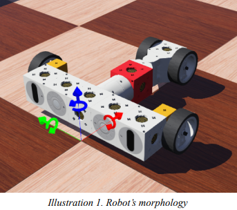
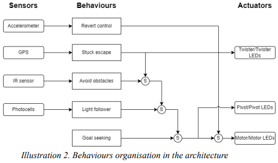
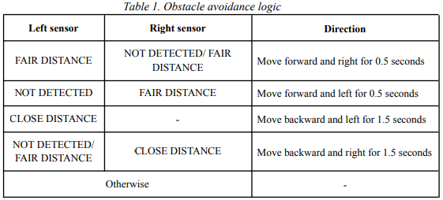
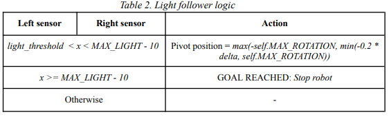

Ragbots
===

This project focuses on developing a robot capable of avoiding obstacles in a simulated environment using Webots [1]. Webots is a professional robot simulator that provides a comprehensive development environment for modeling, programming, and simulating robots. In a maze-like arena, each robot participant is tasked with navigating through a series of obstacles, pitfalls, and challenges to reach a predefined goal location. The terrain is designed to be dynamic, with falls and obstacles
that demand reactability and swift decision-making from the robots.

In order to develop the system the robots must implement the behaviours below. For the aim of this project, the
simulation would be simplified to hold only one robot.

- Goal Seeking: Create a behaviour that enables the robot to recognize and navigate towards the goal
area characterised by a marker.

- Obstacle Avoidance: Develop obstacle avoidance behaviours using sensor data to detect and avoid
collisions with obstacles while moving towards the goal.

- Recovery and Resilience: Develop a mechanism that enables the robot to detect and recover from
unexpected situations, such as getting stuck or overturned.

## Robot morphology
The adaptation of the robot for the task is fundamental, that’s why the components were carefully and manually
selected to make this development more challenging and highlight the capabilities of subsumption architecture.
Each robot is composed of four wheels with one motor, two proximity sensors (IR), two light sensors, a
pivot and a twister.

Tinkerbots [2] is a robotics kit consisting of a basic brick on which various sensors, actuators and structural
blocks can be connected. Within Webots it is possible to assemble them in the same way as in reality allowing to
get a buildable and realistic bot for the development of this project. The illustration 1 shows a sketch of the
selected hand-crafted morphology.



## Sensors
- Distance sensors: Two distance sensors (IR-based), placed on the front-facing section of the robot,
capable of measuring proximity to obstacles.
- Light sensors: Two light sensors placed strategically on the robot to detect the presence and
intensity of light sources (goal).
- Accelerometer: Sensor that measures acceleration and gravity induced reaction forces required to
detect robot’s orientation.
- GPS: Sensor that provides information about the robot’s current absolute position. It will be used to
detect if the robot got stuck (a position movement has been detected).

## Actuators
- Wheel motor (Tinkerbots component): One motor which provides the necessary force to propel a robot
and enable its movement. It can only move either forward or backward of both joints.
- Pivot (Tinkerbots component): Since the proposed morphology only counts with one motor, it does not
allow the use of differential transmission to steer the robot’s path. The use of a pivot provides
controlled rotational motion, facilitating changes in the robot's direction without requiring extensive
movement of the entire robot chassis.
- Twister (Tinkerbots component): A specific joint type that enables rotational movement around a fixed
axis. This rotational joint provides an additional degree of freedom that can be utilised to adjust the
robot's position when it becomes stuck.
- LEDs: Convey important information: mark the robot's status, and provide visual feedback to users.
For instance, a red colour in the distance sensor LED indicates that the sensor is not detecting an
obstacle whereas a green colour indicates the opposite situation.


## Environment
The simulated environment in Webots was designed to challenge the robot's navigation capabilities. Several
different variations have been tested which are composed of the following key elements:

- Falls: Sections of the course where the ground level suddenly dropped, requiring the robot adjust their
navigation system whether its orientation has changed after falling.
- Walls: Vertical obstacles obstructing direct paths to the goal, compelling the robot to find alternative
routes.
- Goal: The ultimate target for the robot, represented by a visible light source, symbolising the endpoint
of the course.

Along with the code, three different environments (Webots worlds) are provided:
- Basic Ragbots World: Composed only by a rectangle arena and the robot without any additional
element.
- Basic Ragbots World with minimal elements: Composed by a rectangle arena, a wall, the goal and
the robot, the minimal elements to fulfil the robot’s motivation (achieve the goal avoiding obstacles).
- Ragbots World: A complete map composed by a series of obstacles, pitfalls, and challenges to reach
the goal location and which allows to test all the functionalities of the robot.

## Implementation
This project utilises the subsumption architecture to enable a robot to perform tasks autonomously. This
architecture comprises multiple layers, each representing a behaviour or set of behaviours, organised
hierarchically, with higher layers possessing greater control and overriding lower layers based on priority. The
illustration 2 represents a diagram of the implemented behaviours and their interaction among them and within
the robot’s components. Below each behaviour is explained in detail sorted by priority (from most to least).



- Revert handler: Use an accelerometer to detect the robot's current orientation and update the
navigation system orientation. Measure the gravity acceleration. If gravity is negative, the robot is
inverted.
- Stuck handler: Use a GPS to detect whether the robot is stuck (position change under stuck_threshold
for max_stuck_time) and try to get unstuck performing a pseudorandom manoeuvre (moving backward
with a random pivot and twister position).
- Obstacle avoidance: Use two distance sensors to detect the distance and position of the obstacles and
implement a manoeuvre to avoid them. It also updates distance sensor colour LEDs.
Set three ranges for each sensor:
    - NOT DETECTED: ```distance >= obstacle_threshold```
    - FAIR DISTANCE: ```close_obstacle_threshold <= distance < obstacle_threshold```
    - CLOSE DISTANCE: ```0 < distance < close_obstacle_threshold```



- Light follower: Use two light sensors to set pivot rotation to drive the robot towards the goal (light)
and stop the motor when it is reached.



- Goal seeking: Explore the world trying to find the goal. Sinusoidal movement across time t with
random parameters (rand_a, rand_b, rand_c).

```
Pivot position = 0. 5 * (𝑠𝑖𝑛(𝑡 * 𝑟𝑎𝑛𝑑_𝑐 + 𝑟𝑎𝑛𝑑_𝑏) * 𝑟𝑎𝑛𝑑_𝑎)
```

## Known problems
- Ambient light source: The presence of a strong ambient light source from the skybox interferes with the light
sensor's ability to differentiate the targeted light source from the background illumination. For this reason, the
environment was simplified by removing the ambient light source, leaving just the goal’s light source. One
possible solution for distinguishing between different sources of light would be filtering in base to the
wavelength, for example.
- Slope changes: Due to the implementation of the robot, ascending ramps are detected as an obstacle because
they fall within the distance sensor range (unless its slope is very low) thus, though the robot would be able to
climb them without problem, the control system will not allow it. One possible solution for detecting this
situation would be to add more sensors for detecting the shape of the element in front and be able to set if it is
possible to move through it.
- Places revisiting: Since the proposed architecture is reactive, the robot does not have a map of the visited
places and can spend much time around the same places looking for the goal. One possible solution for solving
this problem and obtaining an optimal solution to find the goal would be to use a deliberative or a hybrid
architecture instead since they are more suitable for a planning problem.

## References

[1] Cyberbotics: Robotics simulation with webots. (s. f.). https://cyberbotics.com/ (accessed on 2023/12/06)

[2] Webots Documentation - Tinkerbots. (s. f.). https://www.cyberbotics.com/doc/guide/tinkerbots?version=R2021a (accessed on 2023/12/06)
